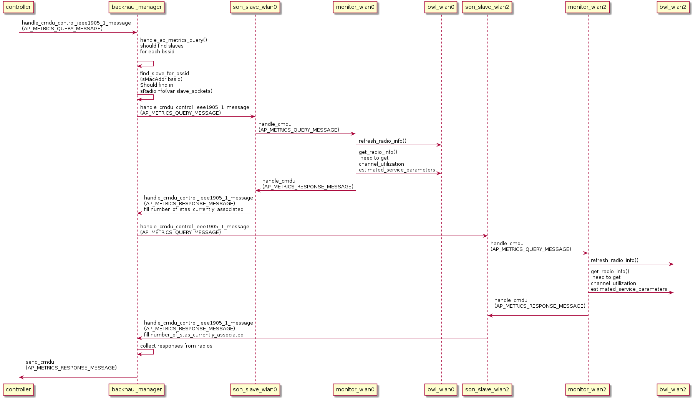
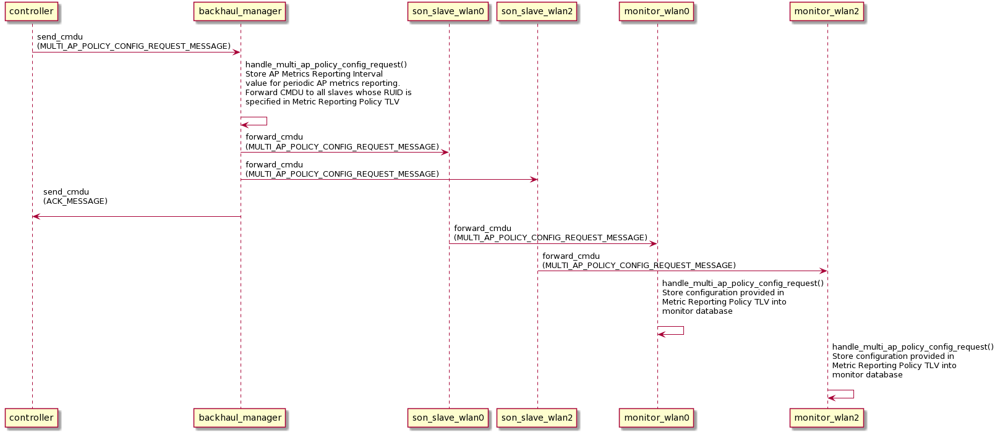
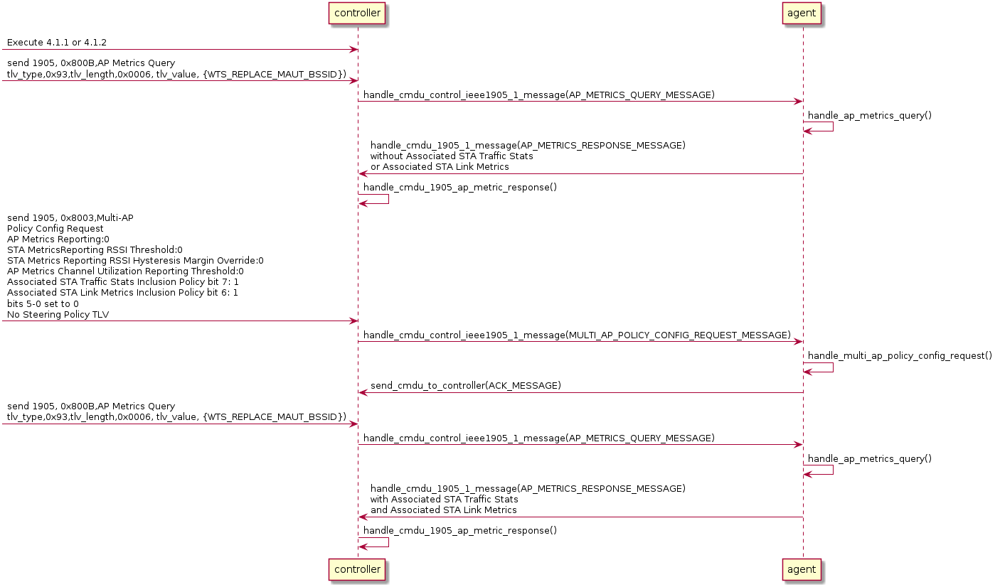
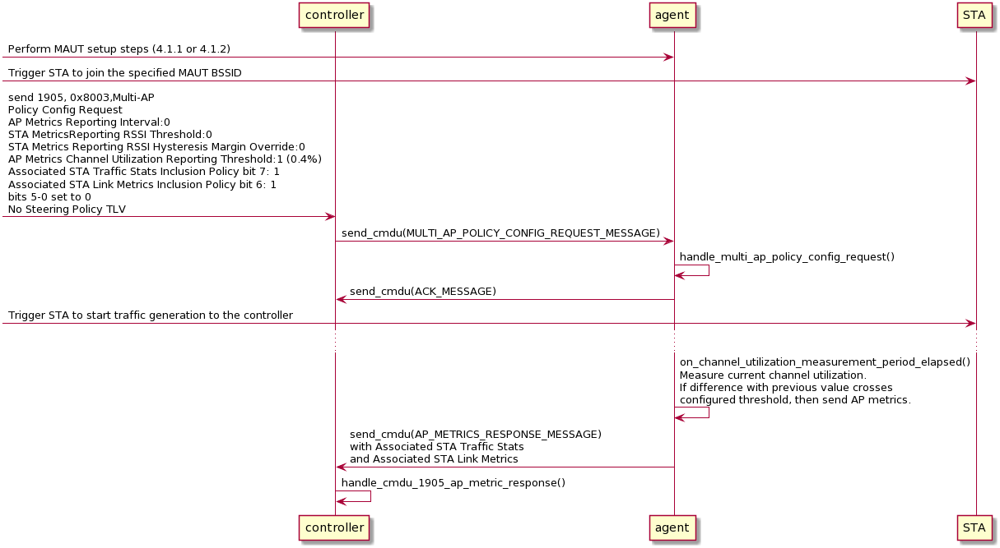

# Introduction

The AP metrics can be requested explicitly or be generated automatically by the agent, based on the reporting policy.
The AP metrics can optionally include station metrics and statistics, as configured by the reporting policy.

# Messages

Access Point Metrics should be represented as 3 messages:

* AP Metrics Query
* AP Metrics Response
* Multi-AP Policy Config Request

## AP Metrics Query

`AP Metrics Query` message has type `0x800b` and tlv type `0x93`.

TLV payload are:

* List of BSSIDs for which the metrics are to be reported.

## AP Metrics Response

`AP Metrics Response` message has type `0x800c`.
It has one or more AP Metrics TLVs with type `0x94` (one per BSSID reported).
Optionally, it has Associated STA Link Metric TLVs (one per STA reported) and/or Associated STA Traffic Stats (one per STA reported).

AP Metrics TLV payload are:

* BSSID for which the metrics are reported.
* Channel Utilization as measured by the radio operating the BSS.
* The total number of STAs currently associated with the BSS.
* Estimated Service Parameters Information field for each Access Category (AC) operated by the AP. This includes Data Format, BA Window Size, Estimated Air Time Fraction and Data PPDU Target Duration subfields.

## Multi-AP Policy Config Request

`Multi-AP Policy Config Request` message has type `0x8003` and two optional TLVs: Steering Policy TLV with type `0x89` and Metric Reporting Policy TLV with type `0x8a`.

For the time being, agent does not do steering so Steering Policy TLV is ignored.

Metric Reporting Policy TLV payload are:

* AP Metrics Reporting Interval in seconds.
* For each radio
    * Radio Unique Identifier.
    * STA Metrics Reporting RCPI Threshold.
    * STA Metrics Reporting RCPI Hysteresis Margin Override.
    * AP Metrics Channel Utilization Reporting Threshold.
    * Associated STA Traffic Stats Inclusion Policy.
    * Associated STA Link Metrics Inclusion Policy. 

# Message flows

## AP Metrics Query/Response flow

AP Metrics can be queried explicitly by the controller.
The response always contains an AP Metrics TLV for each requested BSS.
In addition, the response contains Associated STA Link Metric TLVs and Associated STA Traffic Stats TLVs if the agent was previously configured as such by a Multi-AP Policy Config Request message from the controller.

The AP Metrics message is received by the backhaul manager.
The backhaul manager finds which radio(s) is/are involved based on the BSSIDs in the request.
Then it forwards the request to these slave(s).
The son_slave simply forwards to the monitor.
The monitor does the bwl calls to gather all required information, based on the policy configured in the monitor.
The monitor constructs a response and sends to son_slave, which forwards it to the backhaul manager.
The backhaul manager collects the responses from all radios, and puts them in a single AP Metrics Response message to the controller.

## Multi-AP Policy Config Request flow

Multi-AP Policy Config Request is originated by the controller.
Agent processes the request and responds with an ACK Message.

The Multi-AP Policy Config Request message is received by the backhaul manager.
The backhaul manager stores AP Metrics Reporting Interval value for periodic AP metrics reporting and forwards received message "as is" to all slaves whose RUID is specified in Metric Reporting Policy TLV
The son_slave simply forwards to the monitor.
The monitor stores the radio-specific configuration provided in the Metric Reporting Policy TLV into monitor database if the radio UID matches.

# Certification tests

## 4.7.4 MAUT Per-AP Link Metrics Query Message test query/response

This test verifies that an agent correctly responds to the AP Metrics Query message with an AP Metrics Response message, with one AP Metrics TLV for each of the BSS requested in the query.

AP Metrics Query should pass the following verifications:

* Verify that the controller sends a correctly formatted AP Metrics Query message.
* Verify that the message includes one or more BSSIDs operated by agent.

AP Metrics Response should pass the following verifications:

* Verify that a correctly formatted AP Metrics Response message is sent by the agent.
* Verify that the MID of the agent AP Metrics Response message matches the MID of the controller AP Metrics Query message.
* Verify that the agent transmits the AP Metrics Response message within 1 second of receipt of the AP Metrics Query message.
* Verify that the agent includes one AP Metrics TLV in the response for each of the requested BSSIDs in the query message.
* Verify that each of the AP Metrics TLV is decodable and includes all fields per TLV definition in [1]

For the second response (after the policy has been updated), the AP Metrics Response should pass the following additional verifications:

* Verify that the agent includes one Associated STA Traffic Stats TLV for the associated STA.
* Verify that the Associated STA Traffic Stats TLV is decodable and includes all fields per TLV definition in [1]
* Verify that the agent includes one Associated STA Link Metrics TLV for the associated STA.
* Verify that the Associated STA Link Metrics TLV is decodable and includes all fields per TLV definition in [1]

## 4.7.6 MAUT Per-AP Metrics Response Controlled by AP Metrics Channel Utilization Reporting Threshold test

This test verifies that a MAUT correctly sends AP and STA related metrics in the AP Metrics Response message based on the AP Metrics Channel Utilization Reporting Threshold setting specified by the Controller in the Multi-AP Policy Config Request message.

After setting the policy, a STA is connected to the agent and starts sending traffic. This causes the channel utilization to increase and exceed the configured threshold. At that point, the agent must send an AP Metrics Response message to the controller.

Multi-AP Policy Config Request should pass the following verifications:

* Verify that the controller sends a correctly formatted Multi-AP Policy Config Request message.
* Verify that the message includes a Metric Reporting Policy TLV with all the TLV parameters set as indicated for the controller in this step

AP Metrics Response should pass the following verifications:

* Verify that a correctly formatted AP Metrics Response message is sent by the agent.
* Verify that the agent includes one AP Metrics TLV in the response for each of the operational BSSs on its front radios.
* Verify that each of the AP Metrics TLV is decodable and includes all fields per TLV definition in [1]
* Verify that the agent includes one Associated STA Traffic Stats TLV for the associated STA.
* Verify that the Associated STA Traffic Stats TLV is decodable and includes all fields per TLV definition in [1]
* Verify that the agent includes one Associated STA Link Metrics TLV for the associated STA.
* Verify that the Associated STA Link Metrics TLV is decodable and includes all fields per TLV definition in [1]

# References
[1] Multi-AP 2.0 Specification
