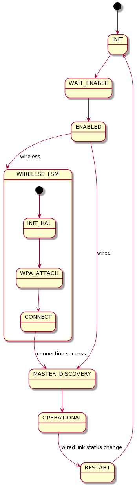
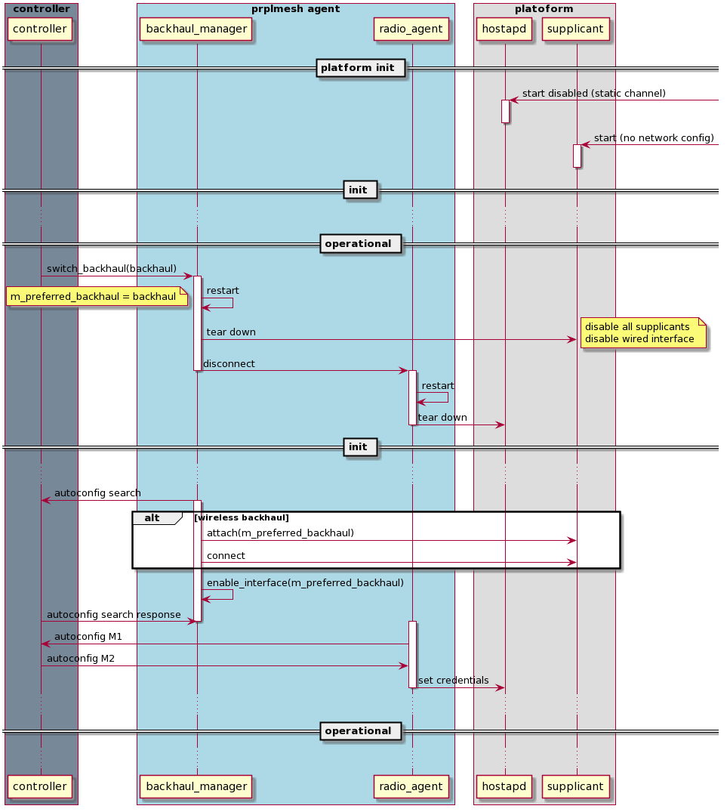

# Introduction

Backhaul Switching is the process where the Repeater / Extender switches from one backhaul link to another.
It can be triggered by any of the following:
1.	Controller backhaul steering request as part of backhaul optimization process ([1] section 12)
2.	Wired backhaul link up/down events – wired link down will trigger backhaul switch to the wireless link, whereas wired link up will trigger a backhaul switch to the wired link.
Future enhancement for selecting the better link (based on phy rate) is out of scope of this document.
3.	UCC commands – for certification, dev_reset_default should reset any previous onboarding state. This means disabling the backhaul, whichever it is. Later, when a dev_set_config is received, switching to the requested backhaul type will take place.

## Current state

Currently, there is no way to dynamically switch from wired to wireless backhaul and vice versa.
There is a disabled polling-based mechanism which switches to the wired backhaul if it is up, but it is disabled since it consumed a lot of CPU. 
Specifically, for certification, only wired backhaul onboarding is supported – e.g. only wired dev_set_config is supported now.

This design provides the guidelines to create a generic mechanism at the backhaul manager to provide backhaul switching support. It will provide an API at the backhaul manager to switch backhaul and start onboarding, which can be triggered from either a UCC command, link up/down events or from a controller backhaul steering request.

The following state diagram shows the backhaul FSM high level design:

The above figure shows that currently, there is a simple FSM restart on wired link status change (which is commented out in the code). This mechanism is currently disabled since wireless-backhaul is not yet  supported and the current implementation causes high CPU load on steady-state.

---
**NOTE**

 The Wireless FSM state is out of scope for this design, since backhaul switching takes place in OPERATIONAL state alone - once the FSM is at the OPERATIONAL state, backhaul switching can be triggered in the backhaul manager on demand, and will result with FSM restart, which in turn will result with selecting a new backhaul.

---

## Requirements

* Generic implementation in the backhaul manager which will provide a single entrypoint to perform backhaul switching from multiple clients
* Supported clients - UCC, Controller, netlink events
* Prevent loops - use only one backhaul at a time
* Repeater static 

## Assumptions

* Wireless backhaul support for certification exists, including `dev_set_config,name,DUT,program,map,backhaul,RUID`
* Repeater static configuration
  * hostapds are configured with start_disabled=1 and static channel at boot
    * the effect is that the AP will NOT hold a channel and will not put anything on-the-air
  * Supplicants are configured for WPS_PBC - `wpa_cli wps_pbc multi_ap=1
` in onboarding mode
  * Supplicants are configured with credentials in operational mode

# High Level Design

Dynamic backhaul switching will be implemented as an API in the backhaul manager - `backhaul_manager_thread::switch_backhaul(const std::string iface_name)` which will move the backhaul manager FSM to the RESTART state, which also causes both radio agents restart.

The backhaul manager FSM RESTART state will be updated to disable all backhaul interfaces by either removing them from the bridge, disabling them via netlink command or by adding an ebtable rule.

Supported backhaul interfaces will be stored in UCI DB:

* Wireless STA interfaces - `prplmesh.radio1.sta_iface='wlanX'`
* Wired interface - `prplmesh.config.wired_backhaul='ethX'`

---

Currently, the wired interface is stored in config file - it is preferred to move it to UCI as a preparative commit to the dynamic backhaul switching feature.

---

In order to support automatic backhaul selection at init, another UCI configuration will be added to indicate the preferred backhaul type: `prplmesh.config.preferred_backhaul='wired/24g/5g/auto'`.

A replication of the preferred backhaul type `m_preferred_backhaul` will be stored as a member variable in the backhaul manager thread which will be used for the dynamic backhaul switching, and can be overriden by clients requesting a backhaul switch.
Note that in order to do a persistent switch, the client needs to also update the persistent UCI DB.

---

Note that `prplmesh.config.preferred_backhaul=auto` is out of scope for this design. It is expected that the client selecting the backhaul switch will set the specific backhaul band, which is the case with `dev_set_config` command and the controller Backhaul Steering Request.

---

## Init sequence

On initialization, prplMesh agent will attach to hostapd and all supplicants, then establish backhaul connection via WPS (first boot) or previousely stored UCI configuration on the preferred backhaul based on `prplmesh.config.wireless_backhaul` uci setting.

If wired backhaul is up, the above will be skipped.

The init sequence described here is assumed to already exist in the platform, and is out of scope of this document.

## Dynamic backhaul switch

On backhaul switch request, the backhaul manager thread will update `m_preferred_backhaul` to the requested backhaul, then move to the `RESTART` state.
In the `RESTART` state, all potential backhauls are first disabled by either one of the following methods:
1. Interface disable vi netlink command
2. Removing the interface from the bridge
3. Setting up an ebtable rule

This is done in order to prevent any loops when connecting to the backhaul later on.

Next, the backhaul manager goes to the `INIT` state, and starts up as it did in boot, only this time the selected backhaul will be the one received from the client which is stored in the `m_selected_backhaul` member. Then, the rest of the standard EasyMesh onboarding takes place (autoconfig search, autoconfig M1, autoconfig M2, etc.).

The following sequence diagram shows the dynamic backhaul switch operation when triggered from the controller.
Simillarly, the switch can be triggered from any other client - UCC command or netlink event.

# References

[1] Repeater system flows.docx (Intel)

[2] ap_seq_review_intel.docx (Intel)

[3] APM_Repeater.docx (Intel)

[4] Multi-AP Specification 2.0

[5] EasyMesh Test Plan 2.0