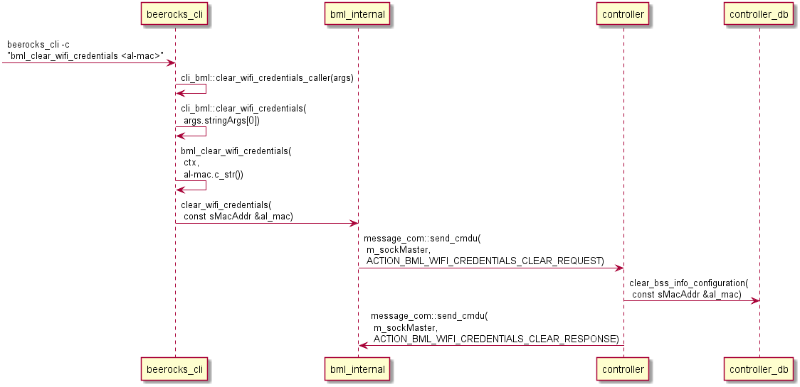

# Introduction

The way to set credentials in EasyMesh is using autoconfig where the controller is configured per alid.
Supported parameters are ssid, password (network key), encryption type, authentication type, operating class and whether to configure as bAP or fAP.
For more information, refer to the WSC M2 message defined in the WSC specification.

Therefore, the bml_set_wifi_credentials command should be updated to support all the new parameters, and delete the unused ones (vap_id and force).
In addition, it should provide another option which is whether to send auto-config renew to all known agents so the new credentials are picked up.

The BML API should be refactored to allow setting credentials for a specific alid, with multiple operating classes.

# Detailed description

Since the bml_set_wifi_credentials command only configures a single SSID, and it should be possible to configure multpile SSIDs atomically, the overall flow is as follows:

* clear the current credentials;
* set the new credentials (multiple times for multiple SSIDs);
* update (which triggers the update in the agent atomically).

## Clear credentials

`bml_clear_wifi_credentials AL-MAC`

Example:

`bml_clear_wifi_credentials 11:22:33:44:55:66`

## Set credentials

`bml_set_wifi_credentials AL-MAC ssid network_key operating_class bss_type`

Where:

- AL-MAC - agent mac address
- ssid - service set identifier
- network_key - password.
Default - empty password, without security.
- operating_class - can be 24g,5g or 24g-5g, list of operating classes.
Default - 24g-5g[1]
- bss_type - can be fronthaul, backhaul, fronthaul-backhaul.
Default - fronthaul.

Example with default values:

`bml_set_wifi_credentials 11:22:33:44:55:66 multiap`

Example for 24g:

`bml_set_wifi_credentials 11:22:33:44:55:66 multiap-24g maprocks1 24g backhaul`

Example for 5g:

`bml_set_wifi_credentials 11:22:33:44:55:66 multiap-5g maprocks2 5g fronthaul`

Example for 24g-5g:

`bml_set_wifi_credentials 11:22:33:44:55:66 multiap maprocks 24g-5g fronthaul-backhaul`

## Update credentials

`bml_update_wifi_credentials AL-MAC`

Example:

`bml_update_wifi_credentials 11:22:33:44:55:66`

# References
[1] 802.11 table E-4 global operating classes
[2] Multi-AP 2.0 Specification
[3] WSC 2.0.6 specification
